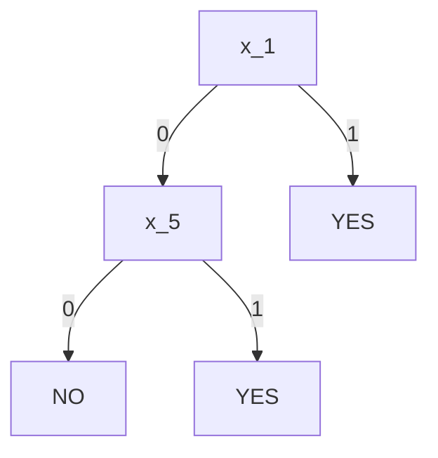

<h1>Lecture 2</h1>

## Concepts
- Supervised learning - useful for concept learning
- Unsupervised learning - algorithm performs grouping on its own
- Mapping inputs to an output function

## Concept learning
In concept learning, we need an algorithm to infer the general definition of some concept, given positive or negative examples.

### Decision tree
**Input:** Training on labeled data ${(x^i,y^i)}$ of unknown target $f$
- Examples described by values on set of features or attributes (e.g. Humidity)

Create a decision tree based on provided data to map an input to a decision tree that accurately predicts the outcome. A simpler tree is always preferred over a complex tree.

## Top-Down Induction of Decision Trees
**ID3**: A natural gredy approach to growing a decision tree top-down (from theroot to leaves by repeatedly replacing an existing leaf with an internal node)

**Algorithm**:
- Pick the "best" attribute to spit at the root based on the training data
- Recurse on children that are impure (e.g. have both yes and no)

**Entropy**: used to measure impurity of $S$
- Let $S$ be a sample of training examples
- $p_\oplus$ is the proportion of positive examples in $S$
- $p_\ominus$ is the proportoin of negaitve examples in $S$

The function we use to compute the entropy value is...
$$H(S) \equiv -p_{\oplus}log_{2}(p_{\oplus})-p_{\ominus}log_{2}(p_{\ominus})$$
- If all negative or all positive, entropy = 0.
- If 50/50 positive and negative, then entropy = 1.
- If 14 examples with 9 positive and 5 negative, then entropy = 0.940