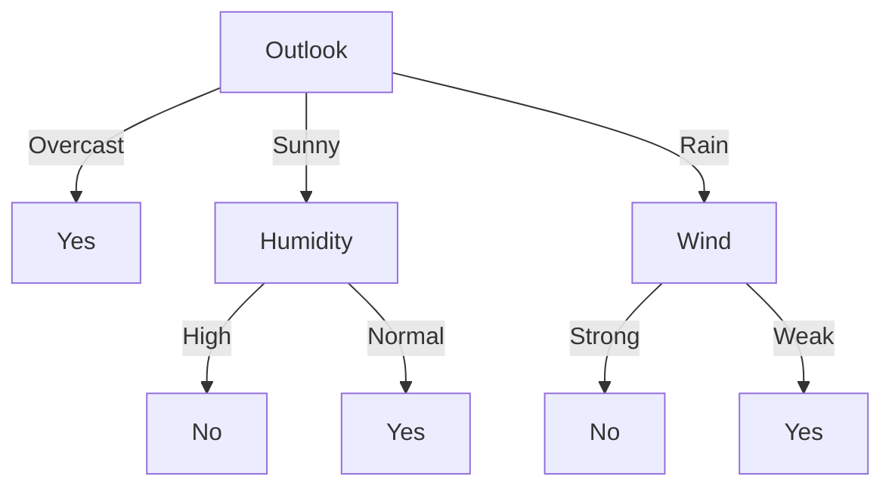

## Decision Trees
Decision tree learning is a method for approximating discrete-valued target functions, in which the learned function is represented by a decision tree.

Decision tree learning is among the most popular **inductive reference algorithms**.

### Representation

Decision trees classify instances by sorting them down the tree from the root to some leaf node, which provides the classification of the instance. Each node in the tree specifies a test of some *attribute* of the instance, and each branch descending from that node corresponds to one of the possible values for the attribute.

For an example, \<Outlook = Sunny, Temperature = Hot, Humidity = High, Wind = Strong\>, we would sort down the middle path. In this case, it would be considered a **negative instance**.

If we had an \<Outlook = Overcast\>, then it would be sorted down the leftmost branch and be considered a **positive instance**. It is a **positive instance** because the tree predicts **yes** for the result.

### Problems
Decision tree learning is an excellent tool, but it is best suited to specific types of problems. These problems have the following characteristics:
- *Instances represented by attribute* -value pairs (e.g, temperature - hot, mild, cold) but it's best to have a small number of disjoint values.
- *The target function has discrete output values* -yes or no. However, decision trees can extend to more than two values. It can not handle continuous values.
- *Disjuntive descriptions may be required*: Decision trees naturally represent disjunctive expressions.
- *Training data may contain errors* - decision trees are robust to errors in classification and attribute values
- *Training data may contain missing attribute values* - decision tree methods can be used even when there are unknown values

Resume page 67 / page 55