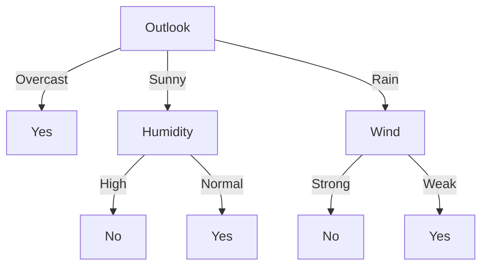

## Decision Trees
Decision tree learning is a method for approximating discrete-valued target functions, in which the learned function is represented by a decision tree.

#decision_tree
Decision tree learning is among the most popular **inductive reference algorithms**.

### Representation

Decision trees classify instances by sorting them down the tree from the root to some leaf node, which provides the classification of the instance. Each node in the tree specifies a test of some *attribute* of the instance, and each branch descending from that node corresponds to one of the possible values for the attribute.

For an example, \<Outlook = Sunny, Temperature = Hot, Humidity = High, Wind = Strong\>, we would sort down the middle path. In this case, it would be considered a **negative instance**.

If we had an \<Outlook = Overcast\>, then it would be sorted down the leftmost branch and be considered a **positive instance**. It is a **positive instance** because the tree predicts **yes** for the result.

### Appropriate problems
Decision tree learning is an excellent tool, but it is best suited to specific types of problems. These problems have the following characteristics:
- *Instances represented by attribute* -value pairs (e.g, temperature - hot, mild, cold) but it's best to have a small number of disjoint values.
- *The target function has discrete output values* -yes or no. However, decision trees can extend to more than two values. It can not handle continuous values.
- *Disjunctive descriptions may be required*: Decision trees naturally represent disjunctive expressions.
- *Training data may contain errors* - decision trees are robust to errors in classification and attribute values
- *Training data may contain missing attribute values* - decision tree methods can be used even when there are unknown values

### Iterative Dichotomiser 3 (ID3)
The algorithm we will study, called ID3 for short, learns decision trees by constructing them top-down, beginning with the question, "which attribute should be tested at the root of tree?"

Each instance attribute is evaluated using a statistical test to determine how well it alone classifies the training examples. The best attribute is selected and used as the test at the root node of the tree.

A descendant of the root node is then created for each possible value of this attribute, and the training examples are sorted to the appropriate descendant node (i.e. down the branch corresponding to the example's value for this attribute).

This process is repeated using training examples for each descendant node to select the best attribute to test at that point.

This forms a greedy search for an acceptable decision tree, in which the algorithm never has to backtrack.

#### Identifying the Best Classifying Attribute
We use a statistical property called *information gain* that measures how well a given attribute separates the training examples according to their target classification. ID3 uses this information gain measure to select among the candidate at tributes at each step while growing the tree.

**Information gain** is defined by a measure commonly used in information theory: *entropy*, which characterizes the impurity of an arbitrary collection of examples.

#information_gain

Given a collection $S$, containing postive and negative examples of some target concept, the entropy of $S$ relative to this boolean clasification is
$$\text{Entropy}(S) \equiv -p_\oplus log_2p_\oplus-p_\ominus log_2 p_\ominus$$
#entropy

#### Example
Suppose in our set $S$ is a collection of 14 examples of some boolean concept, including 9 positive and 5 negative examples, written as \[9+,5-\].

For this collection, we use the entropy equation and compute:
$$\begin{align}
\text{Entropy}([9+,5-]) &= -\frac{9}{14}log_2(\frac{9}{14})-\frac{5}{14}log_2(\frac{5}{14}) \\
&= 0.940
\end{align}$$

The entropy function will yield a number between 0 and 1.

The entropy is 1 when the collection contains an equal amount of positive and negative examples. 

The entropy is closer to 0 when the collection is composed of either mostly negative values, or mostly positive values. (e.g. all positive values or all negative values, entropy=1).

However, examples can take on more than 2 values - they may take on $c$ different values. In this case, we use something called the c-wise classification, which is defined as:

$$\text{Entropy}(S) \equiv \sum_{i=1}^{c}-p_ilog_2p_i$$
In the case the target attribute can take on *c* possible values, the entropy can be as large as $log_2c$.

### Information Gain and Entropy
Given entropy as a measure of impurity in a collection of training examples, we can now define a measure of the effectiveness of an attribute in classifying the data.

The measure used (information gain) is simply the expected reduction in entropy caused by partitioning the examples according to this attribute.

We define this information gain as $\text{Gain}(S,A)$ of an attribute A, relative to a collection of examples S.

$$\text{Gain}(S, A) \equiv \text{Entropy}(S) - \sum_{v\in\text{Values}(A)} \frac{\lvert S_v \rvert}{\lvert S \rvert}\text{Entropy}(S_v)$$

where $\text{Values}(A)$ is the set of all possible values for attribute A, and $S_v$ is the subset of S for which attribute A has value **v** (i.e. $S_v = {s \in S\mid A(s) =v}$). Note that the first term in Equation is just the entropy of the original collection *S* and the second term is the expected value of the entropy of the original collection S.

The value of $\text{Gain}(S,A)$  is the expected reduction in entropy caused by knowing the value of attribute $A$. It is the information provided about the *target function value*, given the value of some other attribute *A*.

The value of $\text{Gain}(S,A)$ is the number of bits saved when encoding the target value of an arbitrary member of *S*, by knowing the value of attribute *A*. 

#### Example
Suppose *S* is a collection of training-example days described by attributes including *Wind*, which can have the values *Weak* or *Strong*. Assume that *S* is a collection of 14 examples, \[9+, 5-\]. Suppose 6 of the positive and 2 of the negative examples have *Wind = Weak* and the others have *Wind = Strong*.

Therefore, we compute the information gain due to sorting *S* by the attribute *Wind* may be calculated as:

$$\begin{align}
\text{Values}(Wind) &= \text{Weak, Strong} \\
S &= [9+, 5-] \\
S_{Weak} &\leftarrow [6+,2-] \\
S_{Strong} &\leftarrow [3+,3-] \\
\end{align}$$

Then, we may compute $\text{Gain}(S, Wind)$.

$$\begin{align}
\text{Gain}(S, \text{Wind}) &= \text{Entropy}(S) - \sum_{v\in\text{\{Weak,Strong\}}}\frac{\lvert S_v \rvert}{\lvert S \rvert}\text{Entropy}(S_v) \\
&= \text{Entropy}(S) - \frac{8}{14}\text{Entropy}(S_{\text{Weak}}) \\
&\quad-\frac{6}{14}\text{Entropy}(S_{Strong}) \\
&= 0.940 - \frac{8}{14}\cdot0.811-\frac{6}{14}\cdot1.00\\
&= 0.048
\end{align}$$

This information gain is precisely the measure used by ID3 to select the best attribute at each step in growing the tree. 

The greater the value of $\text{Gain}(S, A)$, the greater the information gain.

For each node, we determine which attribute to test by selecting the attribute test with the greatest information gain at that point in the tree.

Following the selection of a test attribute, we repeat the process for the descendant nodes of the node.

![[Pasted image 20230203185020.png | center]]

### Advantages and Disadvantages of ID3

Because ID3 performs no backtracking in its search, it is susceptible to converging to a locally optimal solution that is not globally optimal. Furthermore, it does not have the ability to determine how many alternative decision trees are consistent with the available training data.

ID3 is resilient to errors and noise within the training data.

**Occam's razor**: Prefer the simplest hypothesis that fits the data.
#occams_razor

ID3 prefers shorter decision trees.

### Handling Overfitting
We say a hypothesis **overfits** the training examples if some other hypothesis that fits the training examples less well actually performs better over the entire distribution of instances (i.e. including instances beyond the training set).

The formal definition is as follows:
Given a hypothesis space H, a hypothesis $h \in H$ is said to overfit the training data if there exists some alternative hypothesis $h' \in H$, such that $h$ has smaller error than h' over the training examples, but h' has a smaller error than h over the entire distribution of instances. 

![[Pasted image 20230203190549.png]]

In the image above, we see that the tree begins to decrease its accurate despite increasing its accuracy on the training examples.

Random noise can lead to overfitting, but overfitting can occur even when the training data is noise-free.

There are several approaches to avoid overfitting, but they can generally be grouped into two classes:
- approaches that stop growing the tree earlier, before it reaches the point where it perfectly classifies the training data
	- approaches that allow the tree to overfit the data, and then post-prune the tree 

## Naive Bayes
Given the intractable sample complexity for learning Bayesian classifiers, we must look for ways to reduce this complexity. The Naive Bayes classifier does this by making a conditional independence assumption that dramatically reduces the number of parameters to be estimated when modeling $P(X|Y)$, from our original $2(2^n-1)$ to just $2n$.

**Conditional independence**: Given three sets of random variables X, Y, and Z, we say X is **conditionally independent** of Y given Z, if and only if the probability distribution governing X is independent of the value of Y given Z.

The Naive Bayes is classification algorithm based on Bayes rule and a set of conditional independence assumptions. Given the goal of learning $P(Y|X)$ where $X=\langle X_1, \cdot\cdot\cdot, X_n \rangle$ It makes the assumption that each $X_i$ is conditionally independent of each of the other $X_k$s given Y, and also independent of each subset of the other $X_k$'s given Y.

This assumption dramatically simplifies the representation of $P(X | Y)$ and the problem of estimating it from the training data. 

Consider the example where $X = \langle X_1, X_2 \rangle$. In this case, we have that 
$$\begin{align}
P(X|Y) &= P(X_1,X_2|Y) \\
	&= P(X_1|X_2,Y)P(X_2|Y) \\
	&= P(X_1|Y)P(X_2|Y)
\end{align}$$

where the second line follows from a general property of probabilities, and the third line follows directly from ourabove definition of conditional independence. More generally, when X contains n attributes which satisfy the conditional independence assumption, we have:

$$P(X_1, \cdot\cdot\cdot, X_n|Y) = \prod_{i=1}^{n}P(X_i|Y)$$

When $Y$ and $X_i$ are boolean variables, we only need $2n$ parameters to define $P(X_i=x_{ik} | Y=Y_j)$ for the necessary $i,j,k$ (compared to the $2(2^n-1)$ parameters needed to characterize without the conditional independence assumption.

$$\begin{align}
P(Y=y_k | X_1, \cdot\cdot\cdot,X_n) &= \frac{P(Y=y_k)P(X_1,\cdot\cdot\cdot,X_n|Y=y_k)}{\sum_jP(Y=y_j)P(X_1,\cdot\cdot\cdot,X_n|Y=y_j)} \\
&= \frac{P(Y=y_k)\prod_i P(X_i|Y=y_k)}{\sum_j P(Y=y_j)\prod_i P(X_i|Y=y_j)}
\end{align}$$

 If we are interested only in the most probably value of Y, then we have the Naive Bayes classification rule:
$$Y \leftarrow \text{argmax} \frac{P(Y=y_k)\prod_iP(X_i|Y=y_k)}{\sum_j P(Y=y_j) \prod_i P(X_i|Y=y_j)} $$
*\*argmax is an operation that finds the argument that gives the maximum value from a target function* 

We can reduce the equation above to the following (because the denominator does not depend on $Y_k$)

$$Y \leftarrow \text{argmax}_{y_k} P(Y=y_k)\prod_iP(X_i|Y=y_k)$$
### Naive Bayes for Discrete-Valued Inputs
When the *n* attributes $X_i$ each take on $j$ possible discrete values and $Y$ is a discrete variable taking on *K* possible values, then our learning task is to estimte two sets of parameters. The first is 
$$\theta_{ijk} \equiv P(X_i=x_ij|Y=y_k)$$
for each input attribute $X_i$ , each of its possible values $x_ij$, and each of the possible values $y_k$ of $Y$. Note there will be $nJK$ such parameters, and note also that only $n(J-1)K$ of these parameters are independent, given that they must satisfy $1 = \sum_j \theta_{ijk}$ for each pair of $i,k$ values.

In addition, we must estimate parameters that define the prior probability over Y.:

$$\pi_k \equiv P(Y=y_k)$$
In this equation, there are $K$ of these parameters, $(K-1)$ of which are independent.

We can estimte these parameters using either MLE or Bayesian MAP estimates.
MLE for $\theta{ijk}$ given a set of training examples $D$ are given by
$$\hat\theta_{ijk} = \hat P(X_i=x_{ij}|Y=y_k)=\frac{\#D\{X_i=x_{ij}\;\land\;Y=y_k\}}{\#D\{Y=y_k\}}$$

where \#D{X} returns the number of elements in set D that satisfy property X.

### Naive Bayes for Continuous Inputs
When the $X_i$ are continuous, we must use a different approach to represent the distributions $P(X_i|Y)$. One common approach is to assume that for each possible discrete value $y_k$ of $Y$, the distribution of each continuous $X_i$ is Gaussian, and is defined by a mean and standard deviation specific to $X_i$ and $y_k$.

To train such a classifier, we must estimate the mean and standard deviation of each of these Gaussians:
$$\begin{align}
\mu_{ik} &= E[X_i|Y=y_k] \\
\sigma^2_{ik} &= E[(X_i-\mu_{ik})^2|Y=y_k] \\
\end{align}$$

for each attribute $X_i$ and each possible value $y_k$ of $Y$. There are $2nK$ of these parameters, all of which must be estimated independently. We must also estimtae the priors on $Y$ as well.

$$\pi_k = P(Y=y_k)$$

## Logistic Regression
Logistic regression is an approach to learning functions of the form $f: X \rightarrow Y$, or $P(Y | X)$ in the case where $Y$ is discrete-valued, and $X = \langle X_1, \cdot\cdot\cdot, X_n \rangle$ is any vector containing discrete or continuous variables.

Logistic regression assumes a parametric form for the distribution $P(Y|X)$ then directly estimtaes  its parameters from the training data. It is assumed by logistic regression in the case where $Y$ is boolean is:
$$P(Y=1|X) = \frac{1}{1+\text{exp}(w_0+\sum_{i=1}^{n}w_iX_i)}$$
and
$$P(Y=0|X) = \frac{\text{exp}(w_0+\sum_{i=1}^{n}w_iX_i)}{1+\text{exp}(w_0+\sum_{i=1}^{n}w_iX_i)}$$

The second equation follows directly from the first one, because the sum of these two probabilities must equal 1. Using this form allows a simple linear expression for classification.

The classify any $X$, we generally want to assign the value $y_k$ that maximizes $P(Y=y_k|X)$. In other words, we assign the label $Y=0$ if the following condition holds:
$$1 \lt \frac{P(Y=0|X)}{P(Y=1|X)}$$
Using the previous equations of $P(Y=0|X)$ and $P(Y=1|X)$ gives us another form of the equation,
$$1 \lt \text{exp}(w_0+\sum_{i=1}^{n} w_iX_i)$$
and taking the natural log of both sides gives a linear classification rule that assigns label $Y=0$ if X satisfies.
$$0 \lt w_0 + \sum_{i=1}^nw_iX_i$$ and assigns $Y=1$ otherwise.

In simple terminology, if the probability of event $Y=1$ occuring given that $X$ occurs is greater than the probability of event $Y=0$, then the label $Y=0$ will be classified, Otherwise, it will be classified as $Y=1$.

### Derivation of Gaussian Naive Bayes Classifier
Consider a Gaussian Naive Bayes (GNB) classifier with the assumptions:
- Y is a boolean, governed by a Bernoulli distribution, with parameter $\pi = P(Y=1)$
- $X = \langle X_1, \cdot\cdot\cdot, X_n \rangle$ where each $X_i$ is a continuous random variable
- For each $X_i,P(X_i | Y=y_k)$ is a Gaussian distribution of the form $N(\mu_{ik},\sigma_i)$
- For all i and $j \not= i$,  $X_i$ and $X_j$ are conditionally independent given $Y$

In general, Bayes rule allows us to write
$$P(Y=1|X)=\frac{P(Y=1)P(X|Y=1)}{P(Y=1)P(X|Y=1)+P(Y=0)P(X|Y=0)}$$
or, we can also write

$$\sum_i(\frac{\mu_{i0}-\mu{i1}}{\sigma^2_i}X_i+\frac{\mu_{i1}^2-\mu_{i0}^2}{2\sigma^2_i})$$
This is a linear weighted sum of the $X_i$'s. If we perform a substitution, we have that

$$P(Y=0|X) = 1 - P(Y=1|X) = \frac{\text{exp}(w_0+\sigma^n_{i=1}w_iX_i)}{1+\text{exp}(w_0+\sum_{i=1}^nw_iX_i))}$$

where weights $w_1, ..., w_n$ are given by 
$$w_i = \frac{\mu_{i0} - \mu_{i1}}{\sigma_i^2}$$
and $w_0=ln\frac{1-\pi}{\pi}+\sum_i\frac{\mu_{i1}^2-\mu_{i0}^2}{2\sigma^2_i}$

### Estimating Parameters for Logistic Regression
Here, we describe an alternative method for estimating the weights $w_i$ in terms of the parameters estimed by the GNB classifier.

First, for the form of $P(Y|X)$ assumed by Logistic Regression holds in many problem settings beyond the GNB problem detailed in the above section.

One reasonable approach to training Logistic Regression is to choose parameter values that maximize the conditional data likelihood. The **conditional data likelihood** is the probability of the observed $Y$ values in the training data, conditioned on their corresponding $X$ values.

For the equation,
$$W \leftarrow \text{arg max}_W\Pi_lP(Y^l|X^l,W)$$
we choose parameters $W$ to satisfy $argmax$, where $W = \langle w_0,w_1...w_n\rangle$ is the vector of parameters to be estimated.

$Y^l$ denotes the observed value of $Y$ in the $l$th training example, and $X^l$ denotes the observed value of $X$ in the $l$th training example. The expression, $P(Y^l|X^l,W)$ is the conditional data likelihood. We include $W$ in the conditional to emphasize that the expression is a function of the $W$ we are attempting to maximize.

Equivalently, we can work with the log of the conditional likelihood:
$$W \leftarrow \text{arg max}_w \sum_l lnP(Y^l|X^l,W)$$
This conditional data log likelihood, which we will denote $l(W)$ can be written as
$$l(W) = \sum_l Y^l \text{ln} P(Y^l=1|X^l,W)+(1-Y^l)\text{ln}P(Y^l=0|X^l,W)$$

page 12/18
https://www.cs.cmu.edu/~tom/mlbook/NBayesLogReg.pdf

http://www.cs.cmu.edu/~tom/mlbook/Joint_MLE_MAP.pdf

