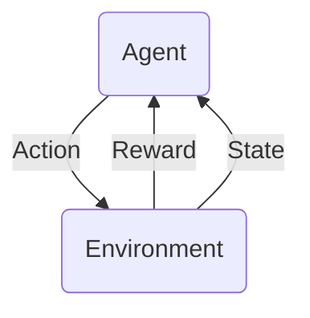

## Trash collector
In this example, we consider the state to be the **location** of the agent.
The actions of the agent are moving up, down, left, or right.
The reward, r=0 if not collected and r=1 if collected.

For any future rewards where r=1, we discount the value and are not valued as much. This is because there could be an infinite amount of states, or the state might never be reached.

### Markov Decision Process
- Set of states, $S$
- Set of actions, $A$
- At each time, the agent observes the state $s_t \in S$ then chooses action $a_t \in A$
- Then receives reward $r_t$ and state changes to $s_{t+1}$
- Markov assumption: $P(s_{t+1} \mid s_t, a_t, s_{t-1}, a_{t-1}) = P(s_{t+1} \mid s_t, a_t)$
- Also assume reward Markov: $P(r_t \mid s_t, a_t, s_{t-1}, a_{t-1}, \cdot\cdot\cdot) = P(r_t \mid s_t, a_t)$

We want to maximize the average of the rewards. The policy is a mapping of state to action that maximizes the reward.
$$E[r_t + \gamma r_{t+1} + \gamma^2 r_{t+2} + \cdot\cdot\cdot] \text{ for } 0 \lt \gamma \le 1$$
for every possible starting state $s_0$.

We also have $r(s, a)$, which specifies the *immediate reward* given a state and action. The control policy maximizes the summation of $r(s_t,a_t)$.

## Bellman Equation

The Bellman equation is given by:
$$V(s) = R(s) + \underset{a\in A}{max}\gamma \sum_{s'\in S}P_{sa}(s')V^*(s')$$

where:
- $V(s)$ is the value of state $s$
- $R(s)$ is the immediate reward obtained from being in state $s$
- $\gamma$ is the discount factor that determines the importance of future rewards relative to immediate rewards
- $P_{sa}(s')$ is the transition probability from state s to state s' when action $a$ is taken
- $V^*(s')$ is the optimal value of state s' (the maximum expected cumulative reward that can be obtained from state s' by following optimal policy)

and the optimal policy can be derived from the optimal value function:
$$\pi^*(s) = \text{arg} \underset{a\in A}{\text{max}}\sum_{s'\in S}P_{sa}(s')V^*(s')*$$

## Limitation
What if we don't have access to the transition probabilities?

We use action-value Q(s,a) instead of value function V(s)