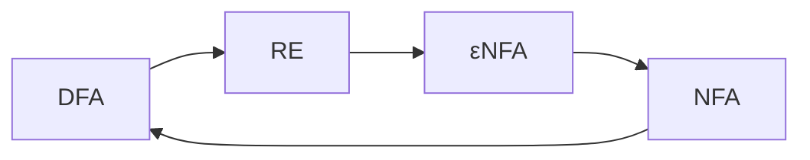

<h1>Lecture 4</h1>

## Scanner
We create a state transition table, which specifies a state and the formal language that it accepts.

Consume tokens until reaching a delimiter, then determine what state to transition to next.

How do we convert a regex to a state transition table? We use a **DFA**.

A regular expression generates an $\epsilon$ NFA - we build an $NFA$ for each term, then connect them with $\epsilon$ moves.

After constructing an $\epsilon NFA$, move to $NFA$ and coalesce states

$NFA \rightarrow DFA$
- Construct the simulation ("subset" construction)
- Minimize the DFA (DFA with minimal number of states)

$DFA \rightarrow$ regular expression
- Construct the regex such that$$R^{k}_{ij}=R^{k-1}_{ik}(R^{k=1}_{kk})^*R^{k-1}_{kj}\cup R^{k-1}_{ij}$$
### Regular expression shortcomings
Regex does not support nesting, which is vital in programming languages. As a result, we use something called **BNF** (Backus-Naur Form), a formal notation for describing syntax - how components can be combined to form a valid program.

**BNF** is used to:
- specify which programs are legal
- describe structure of programs (parse tree)
- write context free grammars

