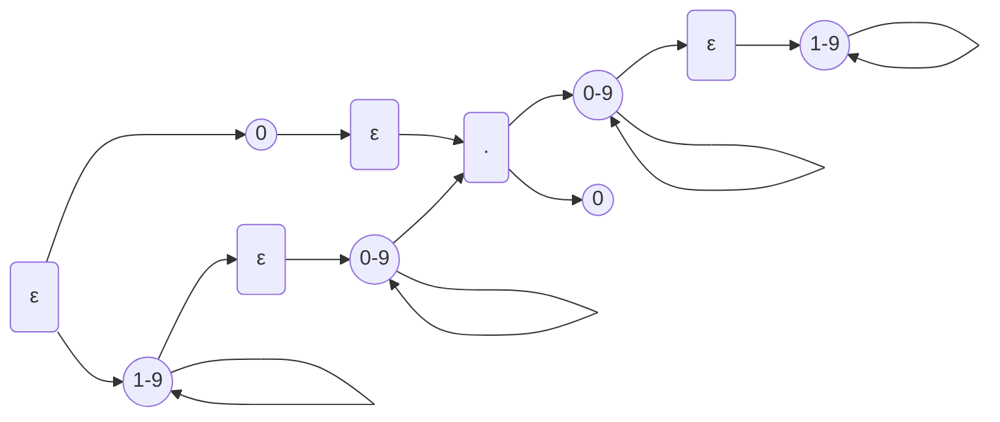

<h1>Homework 1</h1>

<h3>CS314</h3>

## 1 Problem — Three simple rewrite systems
Remember our “rewrite game” in the second lecture. We represent arithmetic values > 0  as sequences of “|” symbols. For example, `|` represents value 1, and `|||||` represents value 5. The input to your rewrite system is either a single value representation, or two value  representations surrounded by a begin ($) and end (#) marker, and separated by a & marker.  For example, the single input value 3 is represented by $|||#, and the input pair 2,5 is  represented by $||&|||||#. The normal forms produced by the rewrite systems do not contain  any markers.  Give rules of rewrite systems that implement different arithmetic operations on our chosen  representation. A rewrite system consists of a set of rewrite rules of the form X ⇒ Y as  discussed in class. You do not have to worry about incorrect input.

1. **Successor function**: $f(x) = x + 1, x>0$
	Example: `$|||#` will be rewritten to `||||`  
	Show the rewrite sequence of your rewrite system for the example input.

**Rule 1**: `$|` $\Rightarrow$ `|$`
**Rule 2**: `$#` $\Rightarrow$ `|`

`$|||#` $\Rightarrow_1$ `|$||#`
`|$||#` $\Rightarrow_1$ `||$|#`
`||$|#` $\Rightarrow_1$ `|||$#`
`|||$#` $\Rightarrow_2$ `||||`

2. **Triple function**: $f(x) = 3 ∗ x, x>0$
	Example: `$|||#` will be rewritten to `|||||||||` Show the rewrite sequence of your rewrite  
	system for the example input.  

**Rule 1**: `$|` $\Rightarrow$ `|||$`
**Rule 2**: `$#` $\Rightarrow$ $\epsilon$

`$|||#` $\Rightarrow_1$  `|||$||#`
`|||$||#` $\Rightarrow_1$ `||||||$|#`
`||||||$|#` $\Rightarrow_1$ `|||||||||$#`
`|||||||||$#` $\Rightarrow_2$ `|||||||||`

3. **Subtraction function**: $f(x,y) = x - y$, $x>0$, $y>0$, and $x >y$
	Example: `$|||&||#` will be rewritten to `|` Show the rewrite sequence of your rewrite  
	system for the example input.

**Rule 1**: `$|` $\Rightarrow$ `|`
**Rule 2**: `|&|` $\Rightarrow$ `&`
**Rule 3**: `&#` $\Rightarrow$ `|`

`$|||&||#` $\Rightarrow_1$ `|||&||#`
`|||&||#` $\Rightarrow_2$ `||&|#`
`||&|#` $\Rightarrow_2$ `|&#`
`|&#` $\Rightarrow_3$ `|`

## 2 Problem — A rewrite system for modulo 3 addition
An interpreter for a language L maps programs written in L to their answers. Remember that a language is a set of words. Let us define our language $L_{add−mod3}$ inductively as follows:

1. The words $0$, $1$, and $2$ are in $L_{add−mod3}$.  
2. Assume that both $A$ and $B$ stand for words in the language $L_{add−mod3}$ . Then
		(a) $(A+B)$ are also in $Ladd−mod3$.

Examples of add-mod3 expressions are: $((1 + 2) + 0)$ and $(1 + (2 + 2))$. However, $1 + 1$ is not in the language (parenthesis are missing).

Give a rewrite system that “evaluates” or “computes” the value of expressions in $L_{add−mod3}$. The operators $+$ corresponds to the standard modulo 3 addition functions given below:

| x   | y   | x+mod3_y |
| --- | --- | -------- |
| 0   | 0   | 0        |
| 0   | 1   | 1        |
| 1   | 0   | 1        |
| 0   | 2   | 2        |
| 2   | 0   | 2        |
| 1   | 1   | 2        |
| 1   | 2   | 0        |
| 2   | 1   | 0        |
| 2   | 2   | 1        |

1. Define a rewrite system for modulo 3 expressions in $L_{add−mod3}$ that produces the final value of the expression. A final value is represented by either 0, 1 or 2. Your rewrite system is basically an interpeter for $L_{add−mod3}$. For example, our two expressions $((1 + 2) + 0)$ and $(1 + (2 + 2))$ should be rewritten to 0 and 2, respectively. You can assume that your rewrite system will only be presented with correct $L_{add−mod3}$ expressions, so don’t worry about error messages.

**Rule 1:** `(0+0)` $\Rightarrow$`0`
**Rule 2:** `(0+1)` $\Rightarrow$`1`
**Rule 3:** `(1+0)` $\Rightarrow$`1`
**Rule 4:** `(0+2)` $\Rightarrow$`2`
**Rule 5:** `(2+0)` $\Rightarrow$`2`
**Rule 6:** `(1+1)` $\Rightarrow$`2`
**Rule 7:** `(1+2)` $\Rightarrow$`0`
**Rule 8:** `(2+1)` $\Rightarrow$`0`
**Rule 9:** `(2+2)` $\Rightarrow$`1`

2. Show your rewrite system steps that are performed for our two example expressions given above. For each step clearly show the left-hand side of the rule in the current expression that you are rewriting.

Example 1: $((1 + 2) + 0) = 0$ 
$((1+2)+0)$, Rule 7 $(1+2) \Rightarrow0$
$(0 + 0)$, Rule 1 $(0+0) \Rightarrow 0$

Example 2: $(1 + (2 + 2)) = 2$
$(1 + (2 + 2))$, Rule 9 $(2+2) \Rightarrow 1$
$(1+1)$, Rule 6 $(1+1) \Rightarrow 2$

3. Is the choice of your next rewrite rule and its left-hand side always unique in your rewrite system? If not, show an example.

No, it is not.

## 3 Problem — Regular expressions
Describe the formal languages denoted by the following regular expressions using the English language
1. $((\epsilon|1)0^*)^*$
	All strings of "1"s and "0"s
1. $0(0|1)^*1(0|1)1$
	All strings of "1"s and "0"s that have the prefix $0$ and the suffix $101$ or $111$.

## 4 Problem — Regular expressions
Write a regular expression for the following language. **You must use the regular language definition introduced in class (see lecture 3)** Make the expression as compact as possible.

For the following solutions, take $A?$ to be $(A\mid \epsilon)$, where $A$ is an arbitrary regular expression. This rule has a similar amount of priority as the $+$ and $*$ rules. 

1. All strings of "a"s, "b"s, and "c"s that contain exactly 2 "a"s
**Solution:** `(b|c)*a(b|c)*a(b|c)*`

2. All strings of "a"s, "b"s, and "c"s that contain at least 1 "b" or at least 3 "c"s
`[abc]*b([abc]*c){3,}` $\Rightarrow$ A string of "a"s, "b"s, "c"s that contains at least 1 "b" and at least 3 "c"s to the right of the b.
	`(a|b|c)*b(a|b|c)*c(a|b|c)*c(a|b|c)*c(a|b|c)*`

`([abc]*c){3,}[abc]*b[abc]*` $\Rightarrow$ A string of "a"s, "b"s, "c"s that contains at least 1 "b" and at least 3 "c"s to the left of the b.
	`(a|b|c)*c(a|b|c)*c(a|b|c)*c(a|b|c)*b(a|b|c)*`

`([abc]*c){2,}[abc]*b([abc]*c)+[abc]*` $\Rightarrow$ A string of "a"s, "b"s, "c"s that contains at least 1 "b" and at least 2 "c"s to the left of the b and 1 "c" to the right.
	`(a|b|c)*c(a|b|c)*c(a|b|c)*b(a|b|c)*c(a|b|c)*`

`([abc]*c)+[abc]*b([abc]*c){2,}[abc]*` $\Rightarrow$ A string of "a"s, "b"s, "c"s that contains at least 1 "b" and at least 1 "c" to the left of the b and 2 "c"s to the right.

**Solution:** `(a|b|c)*((b(a|b|c)*c(a|b|c)*c(a|b|c)*c)|(c(a|b|c)*c(a|b|c)*c(a|b|c)*b)|(c(a|b|c)*c(a|b|c)*b(a|b|c)*c)|(c(a|b|c)*b(a|b|c)*c(a|b|c)*c))(a|b|c)*`

3. All strings of "a"s, "b"s, and "c"s that do not contain more than 1 "b" and no more than 3 "c"s

`a*c?a*c?a*c?a*` $\Rightarrow$ All strings of "a"s and "c"s that contain 3 or less "c"s
`a*b?a*c?a*c?a*c?a*` $\Rightarrow$ All strings of "a"s, "b"s, and "c"s that contain at most 1 "b" and at  most 3 "c"s to the right
`a*c?a*b?a*a*c?a*c?a*` $\Rightarrow$ All strings of "a"s, "b"s, "c"s that contain at most 1 "b" with at most 1 "c" to the left and 2 to the right
`a*c?a*c?a*b?a*c?a*` $\Rightarrow$ All strings of "a"s, "b"s, and "c"s that contain at most 1 "b" with at most 2 "c"s to the left and 1 to the right
`a*c?a*c?a*c?a*b?a*` $\Rightarrow$ All strings of "a"s, "b"s, and "c"s that contain at most one "b" with at most 3 "c" to the right

Combined: `a*((c?a*c?a*c?)|(c?a*c?a*c?a*b?)|(c?a*c?a*b?a*c?)|(c?a*b?a*c?a*c?)|(b?a*c?a*c?a*c?))a*`

However, this regular expression is far from minimal and therefore we must reduce it.

**Solution:** `a*(c?a*(c?a*(c?a*(a*b?)?|b?a*c)|b?a*c?a*c?)|b?a*c?a*c?a*c?)a*`

## 5 Problem — Regular expressions and finite state machines
You are designing a new language with fixed-point numbers. Every fixed-point number should have a unique representation. This means, no leading or trailing 0’s are allowed, and every number must have a “point”. Examples: 
- Allowed: $0.0, 10.0, 45000.007, 0.888$
- Not allowed: $0, 10, 10., 10.00, 045000.007, .888$

1. Write a regular expression for fixed-point numbers for your language.

Let $X_d$ be `(0|1|2|3|4|5|6|7|8|9)` (digits)
Let $X_{nz}$ be `(1|2|3|4|5|6|7|8|9)` (non-zero digits)

$(0\mid X_{nz}X_{d}^*).(X_{d}^*X_{nz}|0)$

2. Give a DFA in the form of a state transition graph that recognizes your language. Note: No need to introduce error states; your DFA can reject the input if it gets “stuck”. Keep your DFA as small as possible.

(NFA)

## 6 Problem — Regular expressions and finite state machines
Use the discussed “translation” strategy for constructing an $\epsilon$-NFA from a regular expression as discussed in lecture 3 for the regular expression.

`letter ( letter | digit )*`

Show the $\epsilon$-NFA for the above regular expression.

![[eps-nfa.excalidraw]]