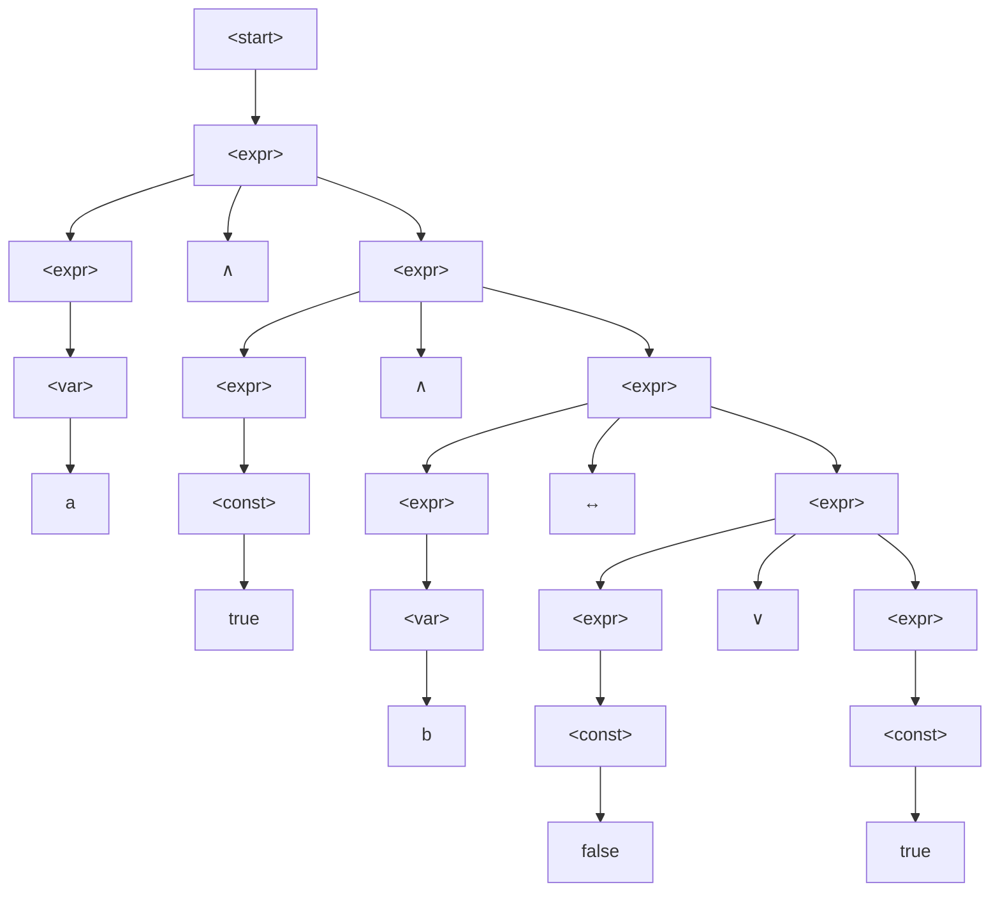
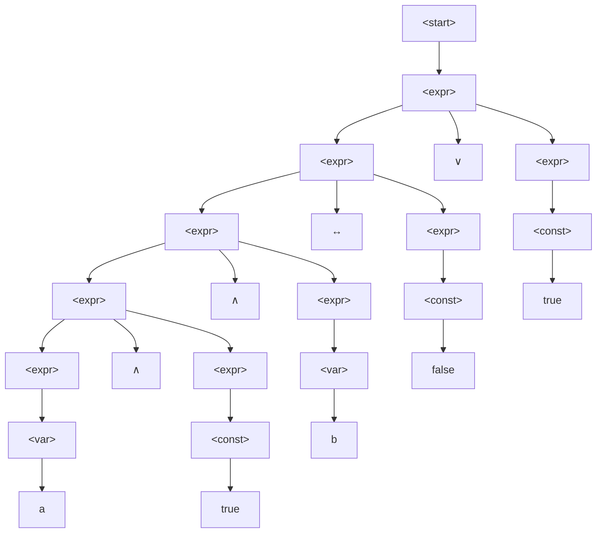
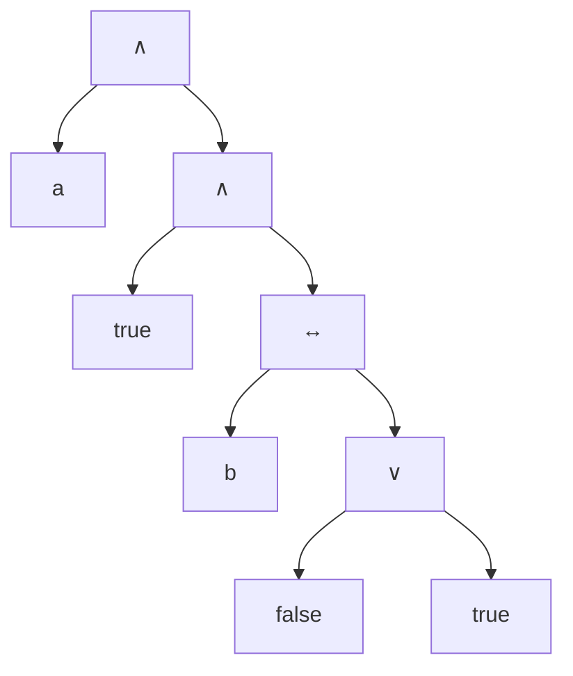
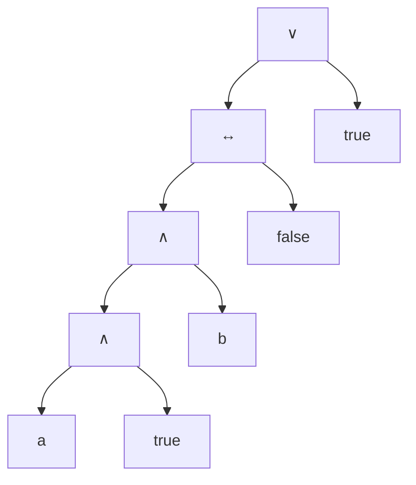
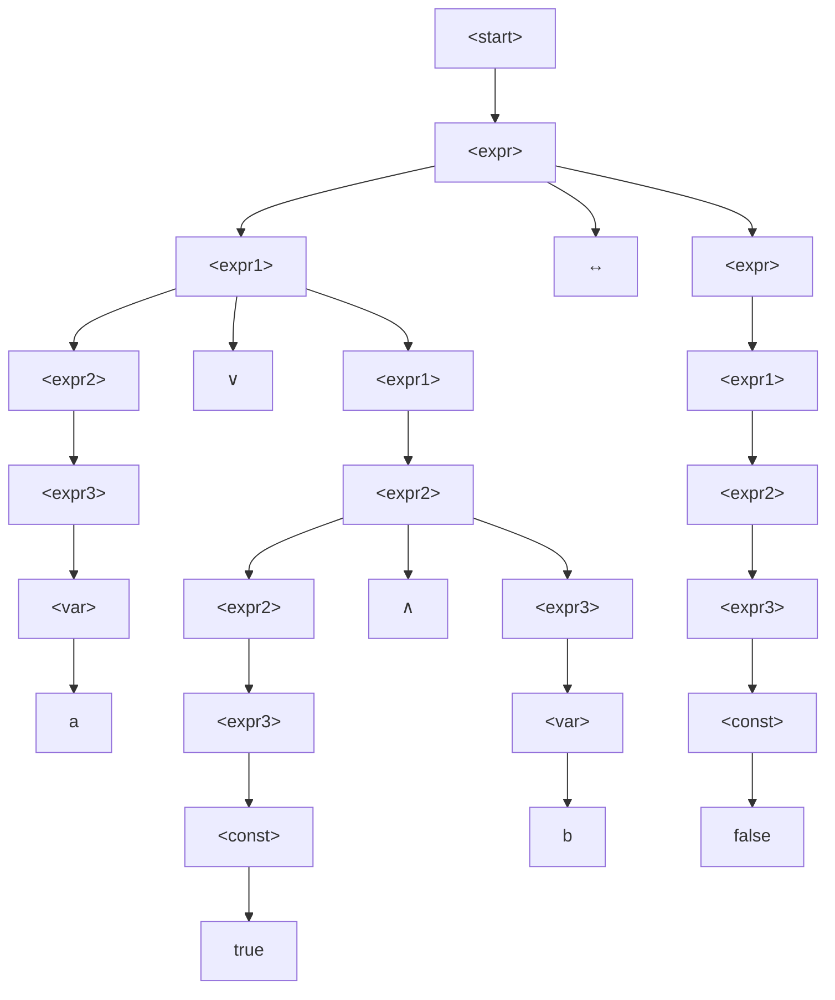
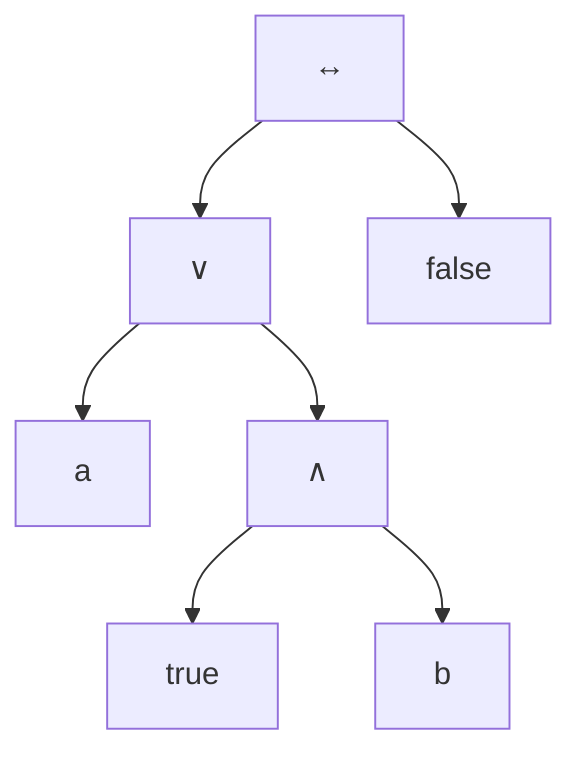

<h1>Homework 2</h1>

<h3>CS314</h3>

## 1 Problem — Finite State Automaton (FSA) - 20 pts

1. Specify the state transition graph of (1) a NFA (which is not DFA as well) without $\epsilon$ transitions and $(2)$ a DFA that recognizes the following language: "All strings of 0's and 1's that end with 11

NFA
![[314hw2_nfa.excalidraw|center]]

DFA
![[314hw2_dfa.excalidraw|center]]

2. In addition to the state transition graphs (diagram), give the state transition table and the formal specification of an automaton as the quadruple $\lt S, s, F, T\gt$ for both, your NFA and DFA. Do not include "error" states.

| S   | s   | F   |
| --- | --- | --- |
| S0  | 0   | S0  |
| S0  | 1   | S1  |
| S0  | 1   | S1  |
| S1  | 1   | S2    |

**NFA**
State transition table

|     | 0   | 1      |
| --- | --- | ------ |
| S0  | S0  | S1, S2 |
| S1  | -   | S2     |
| S2  | -   | -      |

Quadruple <S, s, F T> where...
- $S$ is the set of states **{S0, S1, S2}**
- $s$ is the start state **S0**
- $F$ is the final state **S2**
- $T$ is the set of labeled transitions
	- (S0, 0) $\rightarrow$ S0
	- (S0, 1) $\rightarrow$ S0
	- (S0, 1) $\rightarrow$ S1
	- (S1, 1) $\rightarrow$ S2

**DFA**
State transition table

|     | 0   | 1   |
| --- | --- | --- |
| S0  | S0  | S1  |
| S1  | S0  | S2  |
| S2  | S0  | S2  |

Quadruple <S, s, F T> where...
- $S$ is the set of states **{S0, S1, S2}**
- $s$ is the start state **S0**
- $F$ is the final state **S2**
- $T$ is the set of labeled transitions
	- (S0, 0) $\rightarrow$ S0
	- (S0, 1) $\rightarrow$ S1
	- (S1, 0) $\rightarrow$ S0
	- (S1, 1) $\rightarrow$ S2
	- (S2, 0) $\rightarrow$ S0
	- (S2, 1) $\rightarrow$ S2

## 2 Problem — Regular and Context-Free Languages - 20 pts
Are the following languages context-free or not? If yes, specify a context-free grammar in BNF notation that generates the language. If not, give an informal argument. Furthermore, which of the languages are also regular languages, i.e., can be expressed by a regular expression? Prove it by giving the regular expression that specifies the language.

1. $\{a^nb^mc^o \mid m \gt 0, n \ge 0, o \gt 0\}$, with alphabet $\Sigma = \{a, b, c\}$

This **is a context-free language**.
\<start\> ::= \<A\>b\<B\>c\<C\>
\<A\> ::= a\<A\> | $\epsilon$
\<B\> ::= b\<B\> | $\epsilon$
\<C\> ::= c\<C\> | $\epsilon$

It can be expressed with the regular expression, $a^*b^+c^+$.

2. $\{a^nb^nc^n \mid n \gt 0\}$, with alphabet $\Sigma = \{a,b,c\}$

This **is not a context-free language**. $a^nb^n$ and $b^nc^n$ can be expressed using context-free languages. However, when considering $a^nb^nc^n$, context is necessary to determine how many occurences of $c$ are required. 

Furthermore, it can not be expressed with a regular expression.

3. $\{0^{2n}1^{4n} \mid n \gt 0\}$, with alphabet $\Sigma = \{0,1\}$

This **is a context-free language**, but can not be expressed by regular expression.
\<start\> ::= 00\<start\>1111 | $\epsilon$

4. $\{wcw^R \mid w \in \Sigma^* \text{ and }w^R\text{ is w in reverse }\}$, with alphabet $\Sigma=\{a,b,c\}$

This **is a context-free language**, but can not be expressed by regular expression.
\<start\> ::= a\<start\>a | b\<start\>b | c

5. $\{a^{n} b^{m} c^{m} d^{n} \mid n\ge 0, m \ge 0\}$, with alphabet $\Sigma=\{a,b,c,d\}$

This **is a context-free language**, but can not be expressed as a regular expression.
\<start\> ::= \<AD\>
\<AD\> ::= a\<AD\>d | b\<BC\>c | $\epsilon$
\<BC\> ::= b \<BC\> c | $\epsilon$

6. $\{a^nb^mc^nd^m \mid n \ge 0, m \ge 0\}$, with alphabet $\Sigma = \{a,b,c,d\}$

This **is not a context-free language**. Individually, the pairs $a^nb^m$ and $c^nd^m$ can be defined using context-free languages but together, the number of repetitions $n$ and $m$ can not be generated without context from the other pair. Context is required to determine how many occurences of $a$, which is necessary to determine how many occurences of $c$  are required. The same goes for $b$ and $d$.

Furthemore, it can not be expressed with a regular expression.

7. $\{a^na^nb^nb^n \mid n \ge 0\}$, with alphabet $\Sigma = \{a,b\}$
Note that $a^na^nb^nb^n = a^{2n}b^{2n}$ 
This **is a context-free language**, but can not be expressed as a regular expression.

\<start\> ::= aa\<start\>bb | $\epsilon$

8. $\{w \mid w\text{ has more than 3 symbols}\}$, with alphabet $\Sigma=\{a,b\}$

This **is a context-free language**.
\<start\> ::= \<AB\>\<AB\>\<AB\>\<AB\>\<repeat\>
\<AB\> ::= A | B
\<repeat\> ::= \<AB\>\<repeat\> | $\epsilon$

It can expressed with the regular expression, $(a|b)(a|b)(a|b)(a|b)^+$

## 3 Problem — Derivation, Parse Tree, Ambiguity, Precedence & Associativity - 60 pts

A language that is a subset of the language of propositional logic may defined as follows:

$$\begin{align}
<\text{start}> &::= \quad <\text{expr}> \\
<\text{expr}>  &::= \quad <\text{expr}> \lor <\text{expr}> \quad \mid \\
				&\quad\quad\:\:\: <\text{expr}> \land <\text{expr}> \quad \mid \\
				&\quad\quad\:\:\: <\text{expr}>\:\leftrightarrow <\text{expr}> \quad\mid \\
				&\quad\quad\:\:\: <\text{const}>\:\mid\:<\text{var}> \\
<\text{const}> &::= \text{true} \mid \text{false} \\
<\text{var}> &::= \text{a} \mid \text{b} \mid \text{c}
\end{align}$$

1. Give a leftmost and a rightmost derivation for the sentence
$$\text{a}\,\land\,\text{true}\,\land\,\text{b}\,\leftrightarrow\,\text{false}\,\lor\,\text{true}$$

| Leftmost                                                             | Rule applied |
| -------------------------------------------------------------------- | ------------ |
| \<expr\>                                                             | 1            |
| \<expr\> $\land$ \<expr\>                                            | 2b           |
| \<var\> $\land$ \<expr\>                                             | 2e           |
| a $\land$ \<expr\>                                                   | 4a           |
| a $\land$ \<expr\> $\land$ \<expr\>                                  | 2b           |
| a $\land$ \<const\> $\land$ \<expr\>                                 | 2d           |
| a $\land$ true $\land$ \<expr\>                                      | 3a           |
| a $\land$ true $\land$ \<expr\> $\leftrightarrow$ \<expr\>           | 2c           |
| a $\land$ true $\land$ \<var\> $\leftrightarrow$ \<expr\>            | 2e           |
| a $\land$ true $\land$ b $\leftrightarrow$ \<expr\>                  | 4b           |
| a $\land$ true $\land$ b $\leftrightarrow$ \<expr\> $\lor$ \<expr\>  | 2a           |
| a $\land$ true $\land$ b $\leftrightarrow$ \<const\> $\lor$ \<expr\> | 2d           |
| a $\land$ true $\land$ b $\leftrightarrow$ false $\lor$ \<expr\>     | 3b           |
| a $\land$ true $\land$ b $\leftrightarrow$ false $\lor$ \<const\>    | 2d           |
| a $\land$ true $\land$ b $\leftrightarrow$ false $\lor$ true         | 3a           |

| Rightmost                                                                | Rule applied |
| ------------------------------------------------------------------------ | ------------ |
| \<expr\>                                                                 | 1            |
| \<expr\> $\lor$ \<expr\>                                                 | 2a           |
| \<expr\> $\lor$ \<const\>                                                | 2d           |
| \<expr\> $\lor$ true                                                     | 3a           |
| \<expr\> $\leftrightarrow$ \<expr\> $\lor$ true                          | 2c           |
| \<expr\> $\leftrightarrow$ \<const\> $\lor$ true                         | 2d           |
| \<expr\> $\leftrightarrow$ false $\lor$ true                             | 3b           |
| \<expr\> $\land$ \<expr\> $\leftrightarrow$ false $\lor$ true            | 2b           |
| \<expr\> $\land$ \<var\> $\leftrightarrow$ false $\lor$ true             | 2e           |
| \<expr\> $\land$ b $\leftrightarrow$ false $\lor$ true                   | 4b           |
| \<expr\> $\land$ \<expr\> $\land$ b $\leftrightarrow$ false $\lor$ true  | 2b           |
| \<expr\> $\land$ \<const\> $\land$ b $\leftrightarrow$ false $\lor$ true | 2d           |
| \<expr\> $\land$ true $\land$ b $\leftrightarrow$ false $\lor$ true      | 3a           |
| \<var\> $\land$ true $\land$ b $\leftrightarrow$ false $\lor$ true       | 2e           |
| a $\land$ true $\land$ b $\leftrightarrow$ false $\lor$ true             | 4a           |

2. Give the corresponding parse trees for the derivations.

**Leftmost**

**Rightmost**

3. Give the corresponding abstract syntax tree (AST)
**Leftmost**

**Rightmost**

4. Show that the above grammar is ambiguous.
Take the sentence, $\text{a}\,\land\,\text{true}\,\land\,\text{b}$ , for example.

With the above grammar, we may generate two distinct derivations for this sentence (either two leftmost, or two rightmost), which shows that the grammar is ambiguous.

Derivation 1.

| Leftmost                             | Rule applied |
| ------------------------------------ | ------------ |
| \<expr\>                             | 1            |
| \<expr\> $\land$ \<expr\>            | 2b           |
| \<var\> $\land$ \<expr\>             | 2e           |
| a $\land$ \<expr\>                   | 4a           |
| a $\land$ \<expr\> $\land$ \<expr\>  | 2b           |
| a $\land$ \<const\> $\land$ \<expr\> | 2d           |
| a $\land$ true $\land$ \<expr\>      | 3a           |
| a $\land$ true $\land$ \<var\> | 2e |
| a $\land$ true $\land$ b | 4b           |

Derivation 2.

| Leftmost                                   | Rule applied |
| ------------------------------------------ | ------------ |
| \<expr\>                                   | 1            |
| \<expr\> $\land$ \<expr\>                  | 2b           |
| \<expr\> $\land$ \<expr\> $\land$ \<expr\> | 2c           |
| \<var\> $\land$ \<expr\> $\land$ \<expr\>  | 2e           |
| a $\land$ \<expr\> $\land$ \<expr\>        | 5a           |
| a $\land$ \<const\> $\land$ \<expr\>       | 2d           |
| a $\land$ true $\land$ \<expr\>            | 3a           |
| a $\land$ true $\land$ \<var\>             | 2e           |
| a $\land$ true $\land$ b | 4b |

5. Give an unambiguous grammar for the same language that enforces the following precendence and associativity:
- $\land$ has the highest precedence (binds strongest), followed by a $\lor$, and then $\leftrightarrow$
- $\lor$ is left associative, and $\leftrightarrow$ and $\lor$ are right associative

$$\begin{align}
<\text{start}> &::= \text{<expr>} \\
<\text{expr}>  &::= \text{<expr1>} \:\leftrightarrow\: \text{<expr>} \:|\:\text{<expr1>}\\
<\text{expr1}> &::= \text{<expr2>} \:\lor\: \text{<expr1>} \:|\:\text{<expr2>} \\
<\text{expr2}> &::= \text{<expr2>} \:\land\: \text{<expr3>} \:|\: \text{<expr3>} \\
<\text{expr3}> &::= \text{<const>} \:|\: \text{<var>}\\
<\text{const}> &::= \text{true} \mid \text{false} \\
<\text{var}> &::= \text{a} \mid \text{b} \mid \text{c}
\end{align}$$

6. Give the parse tree and AST for your new, unambiguous grammar for the sentence
$$\text{a} \lor \text{true} \land \text{b} \leftrightarrow \text{false}$$

**Parse tree**

**AST**

